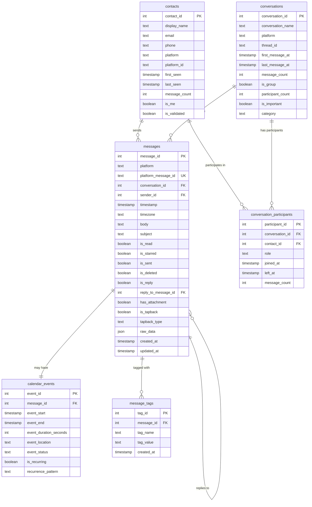

# Database Entity Relationship Diagram

## Mermaid ERD



## Relationship Details

### Primary Relationships

1. **contacts** → **messages** (1:N)
   - One contact can send many messages
   - Foreign key: `messages.sender_id` → `contacts.contact_id`

2. **conversations** → **messages** (1:N)
   - One conversation contains many messages
   - Foreign key: `messages.conversation_id` → `conversations.conversation_id`

3. **conversations** ↔ **contacts** (M:N)
   - Many-to-many relationship via junction table
   - Junction table: `conversation_participants`
   - Foreign keys: 
     - `conversation_participants.conversation_id` → `conversations.conversation_id`
     - `conversation_participants.contact_id` → `contacts.contact_id`

4. **messages** → **messages** (self-referencing 1:N)
   - One message can have many replies
   - Foreign key: `messages.reply_to_message_id` → `messages.message_id`

5. **messages** → **calendar_events** (1:0..1)
   - One message may have one calendar event
   - Foreign key: `calendar_events.message_id` → `messages.message_id`

6. **messages** → **message_tags** (1:N)
   - One message can have many tags
   - Foreign key: `message_tags.message_id` → `messages.message_id`

## Key Design Patterns

### Normalization
- **No data duplication**: Contacts stored once, referenced by ID
- **Referential integrity**: Foreign keys ensure data consistency
- **Junction table**: Enables many-to-many relationships

### Performance
- **Indexes**: On all foreign keys and common query patterns
- **Views**: Pre-computed aggregations for common queries
- **Triggers**: Automatic maintenance of statistics

### Scalability
- **Platform agnostic**: Same schema for all platforms (iMessage, WhatsApp, etc.)
- **Extensible**: Easy to add new platforms or features
- **JSON fields**: Store platform-specific raw data

## Data Flow Example

```
iMessage Import:
  1. Create/Update CONTACTS (phone numbers, names)
  2. Create CONVERSATION (thread)
  3. Insert MESSAGES (link to conversation and sender)
  4. Auto-create CONVERSATION_PARTICIPANTS (via trigger)
  5. Auto-update timestamps and statistics (via triggers)

WhatsApp Import:
  1. Reuse existing CONTACTS (if phone matches)
  2. Create new CONVERSATION for WhatsApp chat
  3. Insert WhatsApp MESSAGES
  4. Cross-platform contact linking (same phone = same person)

Query Across Platforms:
  1. Use CONTACTS as join point
  2. Filter MESSAGES by platform
  3. Aggregate via VIEWS
  4. Return unified timeline
```

## Platform Support

Current platforms stored in database:
- ✅ **iMessage** (`platform = 'imessage'`)
- ✅ **WhatsApp** (`platform = 'whatsapp'`)
- 🔜 **Gmail** (`platform = 'gmail'`)
- 🔜 **Google Calendar** (`platform = 'gcal'`)

Each platform uses identical schema, differentiated only by the `platform` field.

## Views for Quick Access

1. **recent_conversations**: Sorted by last message, includes participant names
2. **contact_statistics**: Per-contact messaging stats and counts
3. **platform_summary**: High-level stats per platform

## Automatic Maintenance

Triggers handle:
- ✅ Timestamp updates on conversation last_message_at
- ✅ Message count aggregation
- ✅ Contact statistics (first_seen, last_seen, message_count)
- ✅ Group conversation detection (participant_count > 2)

## Supabase Compatibility

This schema is PostgreSQL-compatible and can be migrated to Supabase using the migration script in `database/supabase_migration.sql`.

Key differences in PostgreSQL:
- `INTEGER PRIMARY KEY AUTOINCREMENT` → `SERIAL PRIMARY KEY`
- `TIMESTAMP` → `TIMESTAMPTZ` (timezone-aware)
- `JSON` → `JSONB` (binary JSON, faster queries)
- `GROUP_CONCAT` → `STRING_AGG`

